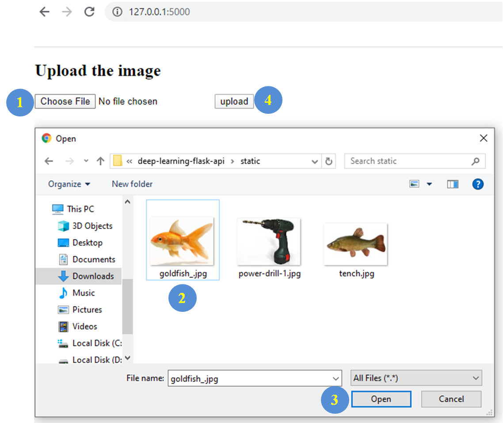
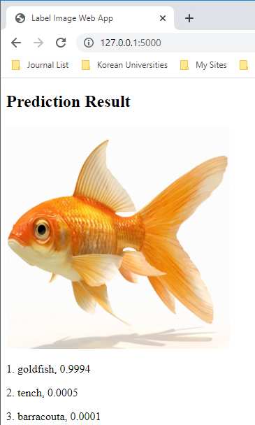
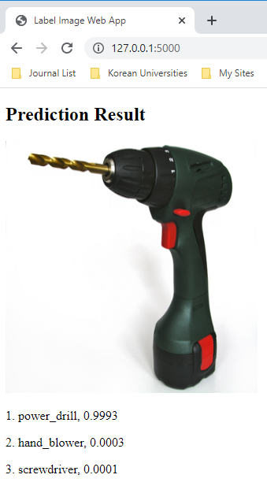
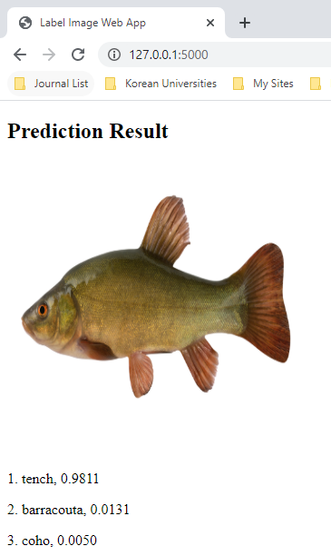

# Deep Leaning Model Deployment using Flask API

This repo contains a sample code to show how to create a Flask API server by deploying our PyTorch model

## Prepare 
```
pip install -r requirements.txt
```

## Run
```
flask run
```

Now go to `http://127.0.0.1:5000/` via chrome browser and upload image. 

<p align="left"></p>

## Result

| GT: goldfish | GT: power drill | GT: tench |
| :-------: |:-------:|:----------:|
| <p align="center"></p> |<p align="center"></p> |<p align="center"></p>|