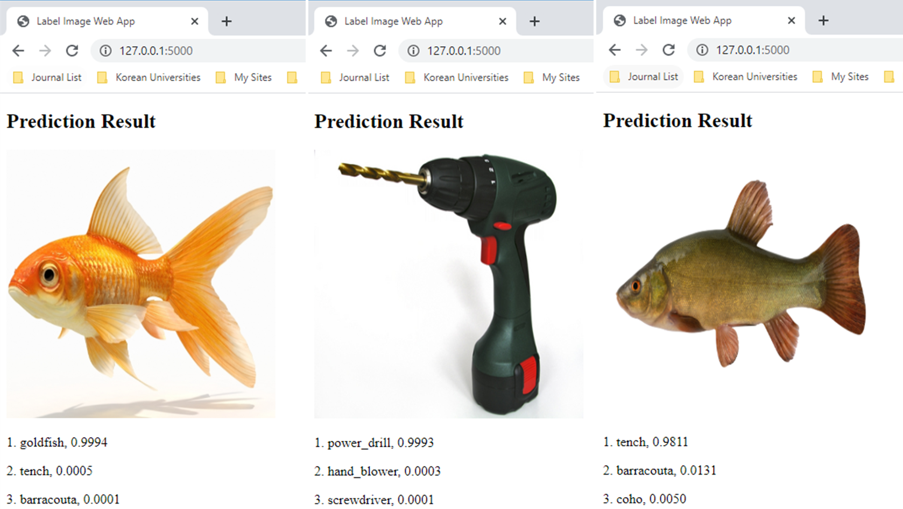

# Deep Leaning Model Deployment using Flask API

This repo contains a sample code to show how to create a Flask API server by deploying PyTorch model. 

## Prepare 
```
pip install -r requirements.txt
```

## Run
```
flask run
```

Go to `http://127.0.0.1:5000/` via chrome browser and upload image from `static` folder. 

<p align="left"></p>

## Results

<p align="left"></p>

## Reference
  
1. [DEPLOYING PYTORCH IN PYTHON VIA A REST API WITH FLASK](https://pytorch.org/tutorials/intermediate/flask_rest_api_tutorial.html)